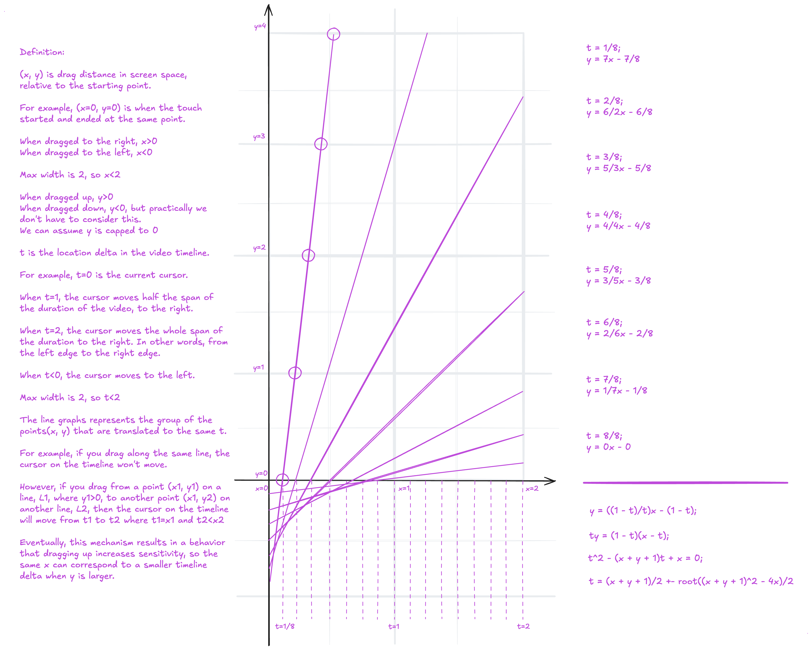

# Scrub Gesture Calculation Design

## Overview

The video editor uses a 2D drag gesture to control timeline scrubbing.

The core behavior is:

- Horizontal movement controls the direction and amount of scrubbing.
- Dragging upward reduces horizontal sensitivity.
- Dragging downward does not affect sensitivity.
- Horizontal dragging can scrub through the entire video, including past the `t = 1` point.
- The mathematical model is symmetric between left and right dragging.
- All coordinate normalization and mathematical calculations belong to the calculation layer, not the SwiftUI caller.

The calculation layer must be UI-agnostic. It should not depend on SwiftUI, `DragGesture`, `AVPlayer`, `CMTime`, or any other UI/video framework.

## Coordinate Model

The calculator internally uses normalized screen-space coordinates.

Given:

```swift
translation: CGSize
viewportSize: CGSize
```

normalize both axes using the viewport width:

```text
x = translation.width / viewportWidth
y = -translation.height / viewportWidth
```

The negative sign on `y` converts SwiftUI screen coordinates into the mathematical coordinate system:

```text
                 +y
                  ↑
                  |
                  |
      -x <--------+--------> +x
                  |
                  |
```

Therefore:

- `x > 0`: dragged right
- `x < 0`: dragged left
- `y > 0`: dragged upward
- `y < 0`: dragged downward

Using viewport width as the normalization unit means:

- `x = 1` = one screen-width horizontal drag
- `y = 1` = one screen-width vertical drag

The caller should not perform this normalization.

## Timeline Parameter

The mathematical model uses a parameter `t`.

`t` is not directly a time value.

It represents a normalized timeline displacement:

```text
t = 0    → 0% of video duration
t = 1    → 50% of video duration
t = 2    → 100% of video duration
```

Therefore:

```swift
timelineFraction = t / 2
```

For example:

```text
t = 0.5 → 25% of video duration
t = 1.0 → 50% of video duration
t = 1.5 → 75% of video duration
t = 2.0 → 100% of video duration
```

The sign of `t` represents direction:

```text
positive → forward
negative → backward
```

The mathematical calculation can operate on `abs(x)` and restore the sign afterward.

## Desired Behavior

### 1. No upward drag

When:

```text
y <= 0
```

the scrub should be directly proportional to horizontal movement:

```text
t = x
```

Therefore:

```text
x = 0.25 → t = 0.25
x = 1.00 → t = 1.00
x = 1.50 → t = 1.50
x = 2.00 → t = 2.00
```

`t = 1` is not a maximum scrub position.

The user must be able to scrub from `t = 0` through `t = 2` while dragging horizontally in the lower portion of the screen.

### 2. Upward drag

When:

```text
y > 0
```

the horizontal sensitivity is reduced.

For a fixed horizontal displacement `x`:

```text
increasing y → decreasing t
```

In other words, dragging farther upward makes the scrub more precise.

### 3. Left/right symmetry

The mathematical model only needs to calculate the magnitude of the scrub.

Use:

```swift
magnitudeX = abs(x)
```

Then restore the direction:

```swift
direction = x < 0 ? -1 : 1
```

Therefore the same calculation works for either direction.

## Mathematical Model



For upward dragging, the original design defines the relationship:

```text
y = ((1 - t) / t) * x - (1 - t)
```

Rearranging:

```text
ty = (1 - t)(x - t)
```

Expanding:

```text
ty = x - xt - t + t²
```

Therefore:

```text
t² - (x + y + 1)t + x = 0
```

Applying the quadratic formula:

```text
t = ((x + y + 1) ± sqrt((x + y + 1)² - 4x)) / 2
```

There are therefore two mathematical solutions.

## Root Selection

The two roots represent two different mathematical branches.

```text
t₋ = ((x + y + 1) - sqrt((x + y + 1)² - 4x)) / 2

t₊ = ((x + y + 1) + sqrt((x + y + 1)² - 4x)) / 2
```

For the intended upward-scrubbing behavior, use the smaller root:

```text
t = t₋
```

For this root:

```text
dt/dy < 0
```

Therefore increasing vertical displacement decreases the scrub amount.

The larger root has:

```text
dt/dy > 0
```

which would make upward dragging increase the scrub amount. That is contrary to the intended UX.

## Why `t = 1` Is Not a Scrubbing Limit

The equation has two roots because the line equation describes two mathematical branches.

At:

```text
y = 0
```

the equation becomes:

```text
0 = (1 - t)(x/t - 1)
```

which gives:

```text
t = 1
```

or:

```text
t = x
```

For:

```text
0 <= x <= 1
```

the smaller root is:

```text
t = x
```

For:

```text
x > 1
```

the `t = x` solution becomes the larger root.

The larger-root branch corresponds to:

```text
slope = (1 - t) / t < 0
```

when `t > 1`.

Those negative-slope lines are intentionally not used for upward scrubbing.

This does not mean that `t > 1` is invalid.

Instead:

- `y <= 0`: `t = x`, allowing `t` to go all the way to `2`
- `y > 0`: use the smaller-root branch
- the negative-slope `t > 1` branch is ignored

## Piecewise Definition

The complete current mathematical behavior is:

```text
                         x = abs(horizontal)
                         y = max(normalizedY, 0)

t(x, y) =
    x                                                if y <= 0

    (x + y + 1
       - sqrt((x + y + 1)² - 4x)) / 2               if y > 0
```

Then restore the horizontal direction:

```text
signedT = sign(horizontal) * t
```

Finally clamp to the supported gesture range:

```text
-2 <= signedT <= 2
```

## Important Boundary Behavior

There is one intentional mathematical discontinuity in the current model.

For:

```text
x > 1
```

at exactly:

```text
y = 0
```

the lower-region rule produces:

```text
t = x
```

For example:

```text
x = 1.5
y = 0

t = 1.5
```

But immediately after entering the upward region, the smaller-root branch approaches `t = 1`:

```text
x = 1.5
y → 0+

t → 1
```

Therefore the current model has a discontinuity when crossing from `y <= 0` to `y > 0` for `x > 1`.

This is a known property of the chosen mathematical model, not a numerical implementation bug.

Do not attempt to fix this by switching to the larger root. Doing so would make upward movement increase `t` for `x > 1`.

If this boundary behavior proves undesirable during interaction testing, it should be addressed by changing the mathematical model rather than by hiding the discontinuity in the implementation.

## Public API

The calculation API should hide all normalization and mathematical details from the caller.

```swift
struct ScrubResult {
    /// Signed normalized timeline displacement.
    ///
    /// -2 = one full video duration backward
    ///  0 = no timeline movement
    /// +2 = one full video duration forward
    let timelineDelta: Double
}

enum ScrubCalculator {
    static func calculate(
        translation: CGSize,
        viewportSize: CGSize
    ) -> ScrubResult
}
```

The SwiftUI caller should only need:

```swift
let result = ScrubCalculator.calculate(
    translation: value.translation,
    viewportSize: geometry.size
)
```

The caller should not need to know:

- how coordinates are normalized
- that the viewport width is used as the normalization unit
- that `y` is inverted
- that `abs(x)` is used
- that a quadratic equation is involved
- which quadratic root is selected
- where `t = 1` comes from
- how the result is clamped

## Recommended Implementation

```swift
import CoreGraphics

struct ScrubResult {
    /// Signed normalized timeline displacement.
    ///
    /// -2 = one full duration backward
    ///  0 = no movement
    /// +2 = one full duration forward
    let timelineDelta: Double
}

enum ScrubCalculator {

    private static let maximumTimelineDelta = 2.0
    private static let discriminantEpsilon = 1e-12

    static func calculate(
        translation: CGSize,
        viewportSize: CGSize
    ) -> ScrubResult {

        guard viewportSize.width > 0 else {
            return ScrubResult(timelineDelta: 0)
        }

        // Normalize both axes using screen width.
        let rawX = translation.width / viewportSize.width
        let rawY = -translation.height / viewportSize.width

        let direction: Double = rawX < 0 ? -1 : 1
        let x = abs(rawX)

        // Downward movement does not affect sensitivity.
        let y = max(rawY, 0)

        let magnitude: Double

        if y <= 0 {
            // Direct horizontal scrubbing.
            magnitude = x
        } else {
            // Upward scrubbing uses the smaller quadratic root.
            magnitude = upwardScrubParameter(
                horizontal: x,
                vertical: y
            )
        }

        let signed = direction * magnitude

        return ScrubResult(
            timelineDelta: signed.clamped(
                to: -maximumTimelineDelta...maximumTimelineDelta
            )
        )
    }

    private static func upwardScrubParameter(
        horizontal x: Double,
        vertical y: Double
    ) -> Double {

        let b = x + y + 1
        let discriminant = b * b - 4 * x

        // Floating-point protection.
        guard discriminant >= -discriminantEpsilon else {
            return 0
        }

        let sqrtDiscriminant = sqrt(max(0, discriminant))

        // Deliberately choose the smaller root.
        let t = (b - sqrtDiscriminant) / 2

        return max(0, t)
    }
}

private extension Double {
    func clamped(to range: ClosedRange<Double>) -> Double {
        min(max(self, range.lowerBound), range.upperBound)
    }
}
```

## Converting the Result to Video Time

`ScrubCalculator` should remain independent of video duration.

The result is converted to actual time elsewhere:

```swift
let timelineFraction = result.timelineDelta / 2
let timeDelta = timelineFraction * videoDuration
let newTime = currentTime + timeDelta
```

For example:

```text
timelineDelta =  2.0 → +100% duration
timelineDelta =  1.0 → +50% duration
timelineDelta =  0.5 → +25% duration
timelineDelta = -1.0 → -50% duration
```

The video layer should then clamp the resulting time to:

```text
0 ... videoDuration
```

## SwiftUI Integration

The SwiftUI integration should contain no scrub mathematics.

Conceptually:

```swift
GeometryReader { geometry in
    VideoView(...)
        .gesture(
            DragGesture()
                .onChanged { value in
                    let result = ScrubCalculator.calculate(
                        translation: value.translation,
                        viewportSize: geometry.size
                    )

                    let timelineFraction =
                        result.timelineDelta / 2

                    let timeDelta =
                        timelineFraction * videoDuration

                    currentTime =
                        initialTime + timeDelta
                }
        )
}
```

The UI layer is responsible only for:

1. Obtaining the drag translation.
2. Providing the viewport size.
3. Passing the result to the video timeline.

All gesture mathematics belongs to `ScrubCalculator`.

## Gesture State

The calculation should be relative to the initial video time at the beginning of the drag, rather than repeatedly applying deltas to the current time.

On gesture start:

```text
dragStartTime = currentTime
```

During the gesture:

```text
currentTime =
    dragStartTime
    + result.timelineDelta / 2 * duration
```

On gesture end:

```text
dragStartTime = nil
```

This prevents accumulated floating-point error and avoids feedback caused by repeatedly applying the calculated delta.

## Unit Tests

The mathematical behavior should be heavily unit-tested independently of SwiftUI.

### Basic normalization

```swift
func testOneScreenRight() {
    let result = ScrubCalculator.calculate(
        translation: CGSize(width: 1000, height: 0),
        viewportSize: CGSize(width: 1000, height: 800)
    )

    XCTAssertEqual(
        result.timelineDelta,
        1,
        accuracy: epsilon
    )
}
```

### Two screens right

```swift
func testTwoScreensRight() {
    let result = ScrubCalculator.calculate(
        translation: CGSize(width: 2000, height: 0),
        viewportSize: CGSize(width: 1000, height: 800)
    )

    XCTAssertEqual(
        result.timelineDelta,
        2,
        accuracy: epsilon
    )
}
```

### Left/right symmetry

```swift
func testHorizontalDirectionIsSymmetric() {
    let right = ScrubCalculator.calculate(
        translation: CGSize(width: 500, height: 0),
        viewportSize: CGSize(width: 1000, height: 800)
    )

    let left = ScrubCalculator.calculate(
        translation: CGSize(width: -500, height: 0),
        viewportSize: CGSize(width: 1000, height: 800)
    )

    XCTAssertEqual(
        right.timelineDelta,
        -left.timelineDelta,
        accuracy: epsilon
    )
}
```

### Downward movement behaves like no vertical movement

```swift
func testDownwardDragDoesNotAffectSensitivity() {
    let horizontalOnly = ScrubCalculator.calculate(
        translation: CGSize(width: 500, height: 0),
        viewportSize: CGSize(width: 1000, height: 800)
    )

    let downward = ScrubCalculator.calculate(
        translation: CGSize(width: 500, height: 300),
        viewportSize: CGSize(width: 1000, height: 800)
    )

    XCTAssertEqual(
        horizontalOnly.timelineDelta,
        downward.timelineDelta,
        accuracy: epsilon
    )
}
```

### Upward movement reduces sensitivity

```swift
func testUpwardMovementReducesSensitivity() {
    let low = ScrubCalculator.calculate(
        translation: CGSize(width: 500, height: -100),
        viewportSize: CGSize(width: 1000, height: 800)
    )

    let high = ScrubCalculator.calculate(
        translation: CGSize(width: 500, height: -1000),
        viewportSize: CGSize(width: 1000, height: 800)
    )

    XCTAssertGreaterThan(
        low.timelineDelta,
        high.timelineDelta
    )
}
```

### Mathematical line tests

The original diagram defines:

```text
t = 1/8
y = 7x - 7/8
```

Pick several points on that line and verify that the calculator returns approximately `1/8`.

Likewise test the lines for:

```text
t = 2/8
t = 3/8
t = 4/8
t = 5/8
t = 6/8
t = 7/8
t = 8/8
```

These tests make the original mathematical diagram an executable specification.

## Recommended Internal Test Helper

For mathematical tests, keep the core normalized solver separate from coordinate normalization:

```swift
enum ScrubCalculator {

    // Public API
    static func calculate(
        translation: CGSize,
        viewportSize: CGSize
    ) -> ScrubResult

    // Internal testable mathematical API
    static func calculateNormalized(
        horizontal x: Double,
        vertical y: Double
    ) -> Double
}
```

The public API handles:

```text
CGSize
  ↓
normalization
  ↓
normalized x/y
  ↓
mathematical solver
  ↓
direction
  ↓
clamping
  ↓
ScrubResult
```

The internal API handles only:

```text
normalized x/y
  ↓
t
```

This makes the equation easy to test independently.

## Mathematical Invariants

The implementation should preserve these invariants.

### Horizontal direction

```text
calculate(+x, y) = -calculate(-x, y)
```

for equivalent magnitude.

### No vertical sensitivity

```text
y <= 0 → t = abs(x)
```

### Upward sensitivity

For fixed `x` on the upward branch:

```text
y₂ > y₁ → t(y₂) <= t(y₁)
```

### Range

```text
0 <= magnitude <= 2
```

and:

```text
-2 <= timelineDelta <= 2
```

### Video independence

The calculator must not depend on video duration.

A 10-second video and a 2-hour video produce the same `ScrubResult` for the same gesture.

## File Structure

Suggested implementation:

```text
Scrubbing/
├── ScrubCalculator.swift
├── ScrubResult.swift
├── ScrubCalculatorTests.swift
└── VideoTimelineScrub.swift
```

Responsibilities:

### `ScrubCalculator.swift`

Pure gesture mathematics and normalization.

### `ScrubResult.swift`

Public result type.

### `ScrubCalculatorTests.swift`

Mathematical and normalization tests.

### `VideoTimelineScrub.swift`

Conversion between normalized timeline displacement and actual video time.

This file may depend on video/time concepts, while `ScrubCalculator` should not.

## Design Principle

> The UI should describe what the user dragged; the calculation layer should decide what that drag means.

The SwiftUI code should never contain the scrub equations or know how coordinates are normalized.

It should simply provide:

```swift
translation
viewportSize
```

and receive:

```swift
ScrubResult
```

That keeps the scrub behavior independently testable and makes it possible to change the mathematical model later without touching the video UI.
