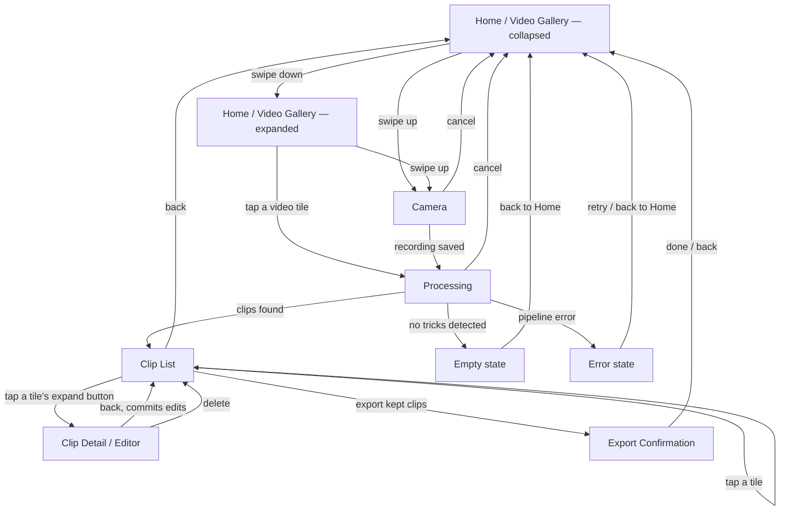

# Turnip — UI/UX Flow (v1 MVP)

*Rev 2 · 2026-09-04 · Draft for review.*

*(Rev 1 established the five-screen flow and made Home a Photos video gallery. Rev 2 resolves the three open questions into decisions.)*

Companion to [`DESIGN.md`](DESIGN.md), which specifies the auto-edit *pipeline*
(pose detection → motion signal → peak detection → crop rect → export). This
doc specifies the *screens* the v1 app needs to carry a user from "I have a
recording" to "clips are in my Photos library," and is scoped to v1
(auto-clip + auto-crop, iOS-only, on-device). It does not cover v2 (community
labeling, following/feed) — those get their own flow notes once the v1 screens
exist and v2 work starts. The Share Sheet and OTA models were scoped here as v2
and have since been built ahead of that; see "Built ahead of this doc" below.

## Why this doc exists

`DESIGN.md`'s "Preview UI" bullet describes behavior ("thumbnail per detected
clip, tap-preview, drag-adjust start/end, keep/discard toggles") but not
screens. In practice that behavior needs at least two distinct screens — a
list/triage view and a per-clip editor — plus states DESIGN.md doesn't
mention at all: a loading state while the pipeline runs, an empty state when
no tricks are detected, and a confirmation state after export. Issue
[#11](https://github.com/hoiekim/turnip-ios/issues/11) currently bundles all
of this into one "Preview UI" issue; this doc exists to pin the flow down
before that issue gets split.

## Screen inventory

The whole app forces dark appearance (`.preferredColorScheme(.dark)` in
`ContentView`) — black backgrounds throughout, no light-mode variant. This is
a v1 product decision (see "Decisions" below), not a per-screen choice.

### 1. Home / Video Gallery

Entry point *is* the picker — every video in the device's Photos library, not
a button that opens a picker sheet. No account, no settings required for v1
— nothing in `DESIGN.md`'s v1 scope needs either. Unlike a conventional
single-layout screen, Home has two states (`Turnip/Home/HomeView.swift`,
`VideoGalleryView`):

- **Collapsed** (the resting/landing state): no title bar — the app mark is
  centered in the space below the peeking row instead. One row of the
  newest 3 videos is pinned at the true top edge (behind the status bar;
  there's no nav bar reserving that space while collapsed), non-interactive.
  Below it, the rest of the screen is empty black down to a fixed bottom bar
  reading "Swipe up to take a video." On launch, the collapsed row slides
  down from off the top edge of the screen into its resting position — the
  landing animation, 600ms. Swiping down anywhere on that row grows it
  toward full screen, oldest-to-newest top-to-bottom: the newest row rides
  the growing frame's bottom edge downward while older videos reveal from
  under the top edge, and past the reveal threshold this commits into the
  second state; swiping up on the bottom bar presents the Camera screen
  full-screen.
- **Expanded**: swiping down from collapsed reveals a normal full-screen
  scrollable grid, oldest-to-newest top-to-bottom (matching the collapsed
  reveal) and opened scrolled to the bottom — the newest videos are visible
  without scrolling, and scrolling up steps back through older ones. The
  title bar is back, every video is tappable, and tapping one goes straight
  to Processing for that video. The "Swipe up to take a video" bar stays at
  the bottom throughout.

**Permission model** (shipped, in `Turnip/Home/`): because Home *is* the
gallery, it enumerates video `PHAsset`s itself rather than delegating to an
out-of-process picker, so it needs real Photos access. As built:
- Read/write authorization (`NSPhotoLibraryUsageDescription`) requested
  on first launch, via `PHPhotoLibrary.requestAuthorization(for:)`.
- **Limited** access shows the granted videos plus a banner opening
  `presentLimitedLibraryPicker`, rather than looking empty.
- **Denied** or restricted access shows an empty state pointing at
  Settings, since there is no picker fallback once Home is the gallery.
- Thumbnails come from a `PHCachingImageManager` prefetching around the
  visible rows, over 60-asset pages, so a library with hundreds of
  videos scrolls without stalling on first load.

### 1a. Camera

- Reached only from Home's swipe-up affordance. Minimal v1 scope: full-screen
  back-camera preview, a cancel chevron, and one record button (tap to
  start, tap again to stop) — no flip camera, flash, or zoom
  (`Turnip/Camera/`).
- Needs `NSCameraUsageDescription` and `NSMicrophoneUsageDescription`
  (Info.plist); denied/restricted access shows a message pointing at
  Settings, matching Home's own denied state.
- A finished recording is saved to the Photos library (via the same
  `ClipPhotosSaver` Export Confirmation already uses) rather than kept as a
  private file — that turns it into an ordinary `PHAsset`, so it re-enters
  the flow exactly the way a tapped gallery tile does: Home calls
  `VideoLibraryViewModel.select(_:)` on the newly-created asset, which pushes
  straight into Processing. No dedicated "recording saved" screen exists;
  the camera cover simply dismisses into Processing's idle state.

### 2. Processing

- The pipeline does not auto-start, but the picked video does: it fills the
  screen (fit to the screen, no native playback chrome) and starts playing
  automatically on arrival, Photos-app style — no tap needed to see it. A thin
  scrub bar (play/pause, seek, mute) draws over the bottom, with a large,
  full-width "Start analysis" button below it — black background, no title,
  no caption text, back chevron to Home. The user watches the autoplaying
  video, pausing/scrubbing it via the scrub bar if they want, and starts
  analysis when ready.
- Once started, the video stays on screen (paused) rather than being replaced
  by a separate page: a progress panel — spinner or determinate bar, plus
  "analyzing frame 400/1200" — overlays the bottom of the still-visible video,
  dimmed behind it. This is not instant for a multi-minute input video, so
  needs real progress feedback, not just a spinner.
- Two exits besides success:
  - **Empty state** — pipeline completes but finds zero trick windows (e.g.
    user picked a video with no motion peaks). Message + back to Home.
  - **Error state** — pipeline throws (unreadable video, pose model failure).
    Message + retry, or back to Home.

### 3. Clip List (triage)

- A grid of square tiles, one per detected trick window, plus a trailing "+"
  tile (grey square, centered plus sign) that appends a new full-frame clip at
  the start of the asset for the user to trim.
- Each tile shows the clip's thumbnail; tapping the tile plays it inline,
  looping the window continuously, rather than navigating anywhere or opening
  a full-screen player. A thin, read-only timeline overlays the bottom edge of
  the tile: it spans the whole source video with the clip's window drawn as a
  highlighted segment, so a glance at the grid shows roughly which part of the
  video each clip is from. It isn't draggable — trimming happens in the editor
  (§4).
- Two small controls overlay the tile's top corners: an expand button
  (top-leading) and the keep/discard toggle (top-trailing) — a quick action
  that doesn't start playback.
- The expand button opens the full Clip Detail / Editor (§4) directly — the
  single entry point into "view large" and "edit," merged rather than a
  separate pencil icon on the tile.
- A "Select All" / "Deselect All" toolbar button at the top marks every clip
  kept or clears every keep flag.
- A visible "Export N clips" action, enabled once at least one clip is kept.
- The back chevron pops to Home, not to Processing; the title sits centered
  inline on the same line as the chevron, Photos-app style.
- This is the part of current issue #11 that's genuinely a list/grid screen.

### 4. Clip Detail / Editor

- Reached from Clip List's expand button (§3) — the tile's single detail entry
  point, not a separate pencil icon. Full-screen, one clip at a time:
  - Video player showing the trimmed clip looping, full frame, with the crop area's
    marker rectangle drawn over it at a fixed position — the dimmed surround marks
    what export cuts away. No default AVKit playback chrome; the only controls this
    screen shows are the custom play/pause and mute buttons and the scrub bar below.
  - The crop area is directly editable: pinch to zoom, rotate with two fingers, and
    drag with one finger to reposition the video underneath the fixed marker
    rectangle — the video zooms/rotates/moves, the marker never does. A "Reset crop
    area" button discards the manual adjustment and returns to the algorithm's own
    framing (issue #9).
  - Scrub bar spanning the whole source video (not a zoomed range around the
    window) with drag handles on start/end — adjusts the trick window from
    issue #8's output; live-updates the crop rect per issue #9 if the window
    changes, since the crop rect is a function of which frames are in play. The
    manual crop adjustment above is independent of this and survives a trim.
    Full-video handles are naturally imprecise on a long clip, so dragging
    farther vertically from the track slows the handle down (common
    photo/video trim gesture): near the track it tracks the touch 1:1; drag
    away and the same finger movement moves it a smaller fraction of the way,
    for fine control. Moving back to the track snaps to full speed again.
  - A Delete button at the top-right corner removes the clip from the list
    entirely — distinct from keep/discard, which stays the list's own toggle.
  - Back to Clip List commits the edits; no separate "save" step needed if
    edits are held in view state until back-navigation.

### 5. Export Confirmation

- Triggered from Clip List's "Export N clips" action. Runs issue
  [#10](https://github.com/hoiekim/turnip-ios/issues/10)'s exporter for
  every kept clip.
- Per-clip progress (export + Photos-library write can fail independently
  per clip — e.g. Photos permission revoked mid-flow).
- Final state: "N of M clips saved to Photos" with any per-clip failures
  called out individually, not just a total count. No further action
  required — user can start over from Home.
- The back chevron pops to Home, not to the clip list; Done pops to Home too —
  the flow is finished and the list state is stale after export. The title sits
  centered inline on the same line as the chevron, Photos-app style.

## Out of scope for this doc

- Accessibility acceptance criteria per screen — those live in
  [`ACCESSIBILITY.md`](ACCESSIBILITY.md) (issue #22) and are checked on each screen's PR.
- Community upload opt-in — v2, layered onto this flow later.
- Settings screen — nothing in v1 scope needs configurable state (aspect
  ratio, buffer duration) beyond the per-clip adjustment already covered by
  Clip Detail's drag handles.
- Visual design (colors, typography, exact layout) — this doc fixes screens
  and transitions, not pixels.

## Built ahead of this doc

Two features this doc scoped as v2 are on `main` already, so a contributor
should start from that code rather than design it again. One of them a user can
already reach:

- **Share Sheet** — `Turnip/Sharing/ClipShareButton.swift`, placed on each row
  of Export Confirmation, which the flow above now reaches from Home. The Share
  action disables itself unless the URL is a file URL that exists when the row
  renders; that check is a render-time snapshot rather than an invariant, so
  the caller owns the file's lifetime from then on.
- **OTA model updates** — `Turnip/ModelUpdates/`: a manifest client, a version
  store with atomic replace, and a service that no-ops when no endpoint is
  configured, which is the case today. No screen this doc specifies surfaces
  it, no app code constructs it, and the doc does not yet say where one would
  go.

## Decisions (formerly open questions)

Resolved 2026-09-04.

1. **Crop rect editing → Manual override added.** Reopened: the auto-crop stopped
   the trick's landing early often enough (and missed the frame often enough on
   some angles) that users need to fix the crop by hand. Clip Detail now supports
   pinch/rotate/drag directly on the crop area, on top of the algorithm's own
   framing, with "Reset crop area" to undo it. The trim handles still re-derive
   the base crop rect from the window; the manual adjustment composes with that
   rather than replacing it.
2. **Bulk keep/discard → Not in v1.** Every clip defaults to "kept"; a user
   discards by tapping individual cards. At ~10 clips per session that's a
   few taps. Add "discard all" only if feedback asks for it.
3. **Cancel during processing → Yes.** Processing (#17) exposes a cancel
   action that returns to Home. It's nearly free with structured concurrency
   (cooperative `Task.isCancelled` checks in the frame-sampler loop, tracked
   in #21), and users will background or leave the screen anyway — a clean
   cancel beats a stuck screen. The flow diagram's `Processing → Home` edge
   covers this path.
4. **Preview framing → Superseded by direct crop editing.** Recorded 2026-09-14
   (issue #88): the editor's player showed the cropped 9:16 framing by default
   with a "Show full frame" toggle for context while trimming. Once the crop area
   became directly editable (decision 1, above), the full frame with the crop
   marker overlaid had to be the only view — the toggle and the cropped-only view
   are both gone, replaced by "Reset crop area."
5. **In-app camera + dark-only theme → Added.** Recorded 2026-09-19: v1 no
   longer requires every video to already be in the Photos library before
   Turnip can see it — Home's swipe-up affordance starts a minimal in-app
   camera (§1a), and a recording is saved to Photos and handed to the
   existing `PHAsset` pipeline unchanged. Home also gained the
   collapsed/expanded two-state layout (§1) and the app forces dark
   appearance everywhere, dropping light-mode support.
